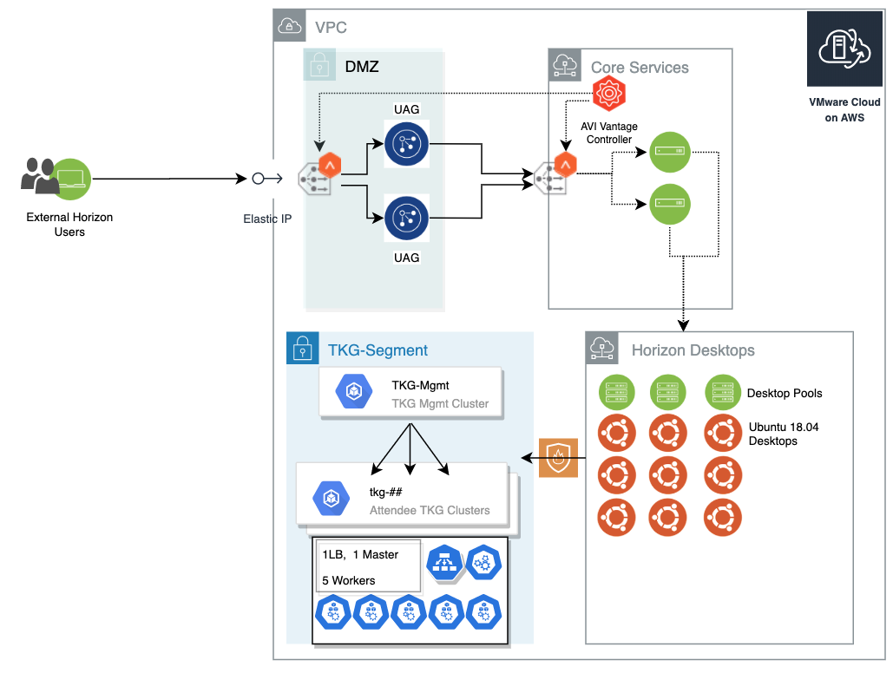

# TKG-Scripts

## Overview

The scripts contained in this repository have been written to address needs that I (or my team) have needed around the Tanzu Kubernetes Grid (TKG).

## createClusters.sh

As an enablement team, the VMware Cloud Services [Livefire](https://www.livefire.solutions) team needs to be able to deploy TKG Clusters to VMware Cloud on AWS quickly and consistently for up to 25 attendees.

Our attendees will each be given a Linux Ubuntu based Horizon Desktop with some name, for example: ATT-CS-L-01. At the time of TKG Cluster creation, the kubeconfig for the cluster number matching the attendee desktop number should be copied to the desktop via SCP. Additionally, a small range of IP addresses should be populated in a Kubernetes config map yaml file and placed on the attendee desktop as well for use in one of the labs.



The first script in this repository: createClusters.sh addresses the above need.

I've tried to make the script as reusable as possible.

### Prerequisites

- tkg binary should already be installed
- tkg admin cluster should already be initialized
- ~/.tkg should be present on system to run this script - with valid _config.yaml_

**Usage:**

```bash
# ./createClusters.sh ## ( ## should be a number from 1-99)
# For example:
createCluster.sh 25
```

Without modification, the above command should result in:

- 25 single master/5 worker clusters named: tkg-01 - tkg-25


- Kubeconfig merged into Local ~/.kube/config for each cluster


- 25 metal-lb-##.yaml files containing configuration for a range of 4 ip addresses
- 25 tkg-##.kubeconfig files (one for each cluster created)
- The .yaml and .kubeconfig files copied to corresponding remote system with suffix ## - matching the cluster number
- A cleanup script that:
  - Deletes each tkg cluster
  - Deletes the .kubeconfig and .yaml
  - Removes the Cluster, Context, and User from the local .kube/config file (these were merged into the local config as the credentials were exported during the script)

```bash
# Cleanup Script
tkg delete cluster tkg-01 -y
kubectl config unset clusters.tkg-01
kubectl config unset contexts.tkg-01-admin@tkg-01
kubectl config unset users.tkg-01-admin
rm tkg-01.kubeconfig
rm metal-lb-01.yaml
tkg delete cluster tkg-02 -y
kubectl config unset clusters.tkg-02
kubectl config unset contexts.tkg-02-admin@tkg-02
kubectl config unset users.tkg-02-admin
rm metal-lb-02.yaml
rm tkg-02.kubeconfig
```
